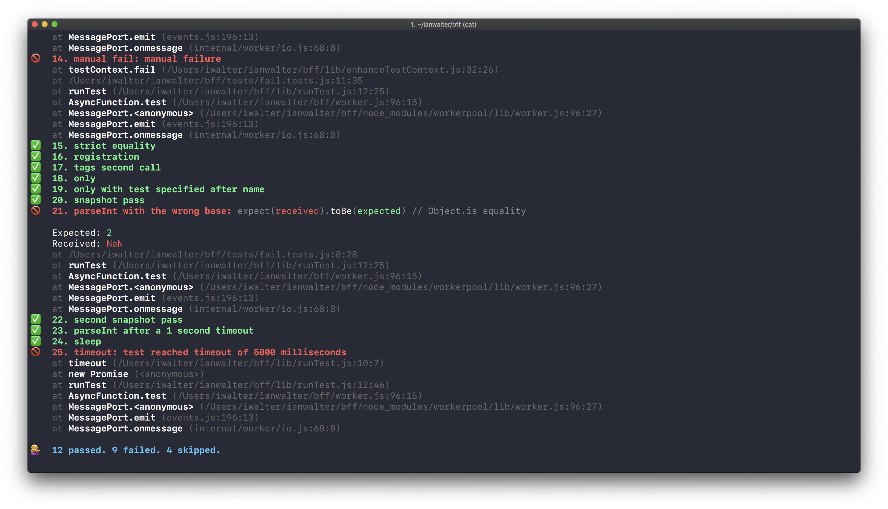

# @ianwalter/bff
> Your friendly test runner/framework

[![npm page][npmImage]][npmUrl]
[![CI][ciImage]][ciUrl]

[](https://raw.githubusercontent.com/ianwalter/bff/master/screenshot.png)

## Installation

```console
yarn add @ianwalter/bff --dev
```

## CLI Usage

You can pass **all** configuration described in the next section through the CLI
using a dot syntax for nested configuration properties, e.g.
`bff --puppeteer.dumpio true`. Test files can be specified as input without a
flag, e.g. `bff tests/example.tests.js`. Array values can be specified with
multiple flag instances, e.g. `bff -t dev -t qa`.

The following top-level options are also aliased to shorter flags for
convenience:

* `--log-level, -l [level]` Specifies bff's logging level.
* `--fail-fast, -f` Specifies whether to exit when a test fails instead of
  continuing to run tests.
* `--update-snapshot, -u` Specifies whether snapshots should be created or
  updated.
* `--concurrency, -c [#]` Specifies how many tests/workers to run in parallel.
* `--tag, -t [name]` Specifies which test tags should be used to match tests.
  How it matches the tags depends on the `match` option below.
* `--match, -m [type]` Specifies whether a test needs `some` or `every`
  specified tag in order for it to be run.
* `--timeout, -T [milliseconds]` Specifies how long a test should take before
  it's marked as failed for timing out.
* `--junit, -j [file]` Specifies whether or not to write the results to a junit
  report file.
* `--verbose, -V` Prints more information for each test: test tags, relative
  file path, and timing information.

## Configuration

Configuration can be specified under the `bff` property in the current working
directory's `package.json`. The following is a snapshot of the available options
with their **default** values:

```js
{
  bff: {
    // Specifies what files to consider test files.
    // Value should be an array of file paths/globs.
    tests: [
      'tests.js',
      'tests.pptr.js',
      'tests/**/*tests.js',
      'tests/**/*pptr.js'
    ],
    // Specifies bff's logging level.
    // Possible values include: 'debug', 'info', 'warn', 'error', 'fatal'
    logLevel: 'info',
    // Specifies whether to exit when a test fails instead of continuing to run
    // tests.
    // Value should be a boolean.
    failFast: undefined,
    // Specifies whether snapshots should be created or updated.
    // Value should be a boolean (although in practice it only makes sense to
    // use this option with the CLI).
    updateSnapshot: undefined,
    // Specifies how many tests/workers to run in parallel.
    // Value should be a integer.
    concurrency: 4, // This defaults to the number of the host system's CPU
                    // cores minus one.
    // Specifies which test tags should be used to match tests. How it matches
    // the tags depends on the `match` option below.
    // Value should be an array of strings, e.g. ['dev', 'qa'].
    tag: undefined
    // Specifies whether tests have to contain every or at least one specified
    // tag in order to be matched and run.
    // Value should be an array test method ('some' or 'every').
    match: 'some',
    // Specifies how long a test should take before it is marked as failed for
    // timing out.
    // Value should be a length of time in milliseconds (integer).
    timeout: 60000,
    // Specifies whether or not to write the results to a junit report file.
    // Value should either be a boolean or a string specifying the relative path
    // of the report file.
    junit: undefined,

    // Configuration specified under this property will be passed directly to
    // Puppeteer's launch method. See Puppeteer's documentation for information
    // on those options:
    // https://pptr.dev/#?product=Puppeteer&show=api-puppeteerlaunchoptions
    puppeteer: {
      // Treat all test files as puppeteer test files regardless of whether the
      // test file contains the .pptr.js file extension or not.
      // Value should be a boolean.
      all: undefined
    }
  }
}
```

## Writing tests

Declare a test by using the `test` tagged template literal with a description
of the test and a test function as an interpolated value:

```js
const { test } = require('@ianwalter/bff')
const someFunctionality = require('./someFunctionality')

test`Some functionality ${t => t.expect(someFunctionality()).toBeTruthy()}`
```

Your test description can contain as many newlines as you'd like and it will
still be formatted as a single line:

```js
test`

Some functionality when some environment variable is set, the user has some
localStorage value, and some query parameter has a certain value

${t => {
  t.expect(scenario).toMatchSnapshot()
}}
`
```

### Modifiers

You can skip individual tests by adding the `.skip` modifier:

```js
test.skip`Something ${t => t.expect(something).toBe(somethingElse)}`
```

You can also have only designated tests in a test file run with the `.only`
modifier:

```js
test.only`Focus ${t => t.expect({}).toEqual({})}`
```

If you have flaky tests and you don't necessarily want them to fail a test run
but would like to be warned when they fail, you can use the `.warn` modifier:

```js
test.warn`Payfail checkout ${async t => {
  t.expect(await payfailCheckout()).toEqual({ success: true })
}}`
```

### Test Suites

You can compose test suites of tests using tags:

```js
const { test, tag } = require('@ianwalter/bff')

test`

Every product displayed is active

${tag`production`} ${testEnvironmentTags}

${t => {
  // Some test logic here.
}}
`

// TODO: add CLI example below
```


## Related

* [`@ianwalter/bff-webdriver`][bffWebdriverUrl] - A bff plugin to enable
  WebDriver-based testing
* [`@ianwalter/bff-puppeteer`][bffPuppeteerUrl] - A bff plugin to enable
  Puppeteer-based testing

## License

Apache 2.0 with Commons Clause - See [LICENSE][licenseUrl]

&nbsp;

Created by [Ian Walter](https://iankwalter.com)

[npmImage]: https://img.shields.io/npm/v/@ianwalter/bff.svg
[npmUrl]: https://www.npmjs.com/package/@ianwalter/bff
[ciImage]: https://github.com/ianwalter/bff/workflows/CI/badge.svg
[ciUrl]: https://github.com/ianwalter/bff/actions
[bffWebdriverUrl]: https://github.com/ianwalter/bff-webdriver
[bffPuppeteerUrl]: https://github.com/ianwalter/bff-puppeteer
[licenseUrl]: https://github.com/ianwalter/bff/blob/master/LICENSE
